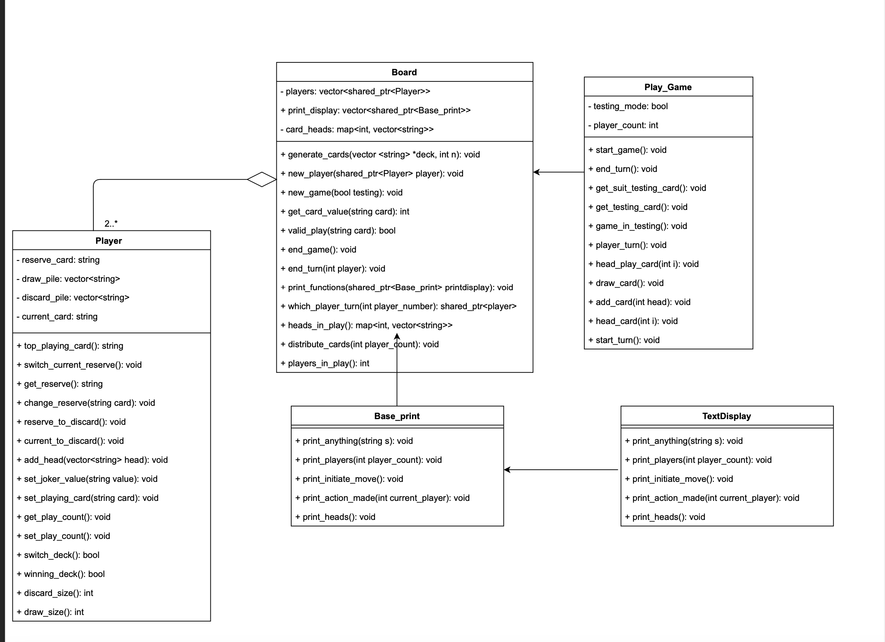

# CLI Card Game
A project built to practice OOP principles (encapsulation, abstraction, inheritance, polymorphism). Observer design pattern was used to implement the classes.

### Design diagram
A detailed description of each class is available below.

### Demo
Demo is available [here](https://drive.google.com/file/d/1F4WbZJXN0VNt8NF0UE5Gfml7PTMzKi6R/view?usp=sharing)

### Overview
#### Classes Used

**Play_Game:**:
This is perhaps the most important class. It is entirely responsible for the operation of the game. It keeps track of which player’s turn it is, updates the heads, and the player cards as necessary. It is also responsible for reading in from input for the necessary moves by the player. If the game is
in testing mode, it ensures that the user gets to choose the state of the board -- that is, the number of cards each player gets, and each player decides which card they wish to play. Once the game has finished, it outputs a prompt stating the winning player, and then exits.

**Board:**
The board class is the backbone of all the other classes, “pulling them together”. It stores all the information of the game state: each player, the heads, and it is also responsible for using TextDisplay to print out the necessary output. It determines if the card being played by any player is valid, and the attempted head that it is being placed on actually exists. A map was used to store the heads (see Board.h). Although the original plan was to have a head class and store them in a vector, it quickly became difficult, since if a head was no longer in play the vector would require indexing. A much simpler solution was to utilize a dictionary, where each integer
which is the head index is mapped to the head itself.

**Player:**
The Player class keeps track of each player and the cards that they have. It keeps the draw pile and the discard piles separate in a vector, as well as the current and reserve card in strings.
Additionally, the corresponding methods in this class allow for modification of their deck as required, thus, it makes it easier for Play_Game to use this class to make any modification for
each player. The number of functions required to implement this class was clearly underestimated. In order to ensure encapsulation, the classes other than Player did not have
access to the vector of cards: so, every movement of a card required a method. These include getting the top card, switching the card, getting the card from reverse, changing any specific
card, getting the size of their draw and discard piles, etc.

**Base_print:**
This class is the print class that Board uses to call all the methods from TextDisplay. TextDisplay inherits from Base_print. So, any changes to the printing function are quickly recoverable with minimal modifications.

**TextDisplay:**
The TextDisplay class is responsible for outputting the correct output in the correct format to the console. Depending on the action, Play_Game calls each separate function to output as desired. In detail, it will print the players, the heads in play, if a player is in winning state then the winning play, and the corresponding actions made by the player that requires input. This class is inherited publicly from Base_print which is associated with the board class (see Base_print.h).

**Design:**
Many techniques were used to make the game in this project. Firstly, to ensure encapsulation between player and it’s associated classes, it quickly became relevant to implement new
functions in the movement of the cards. After producing the functions in the original UML plan, it became apparent that there are a lot more movements of the cards that are possible. Another
technique used was to use map storage in the stl library. The original idea was to have a head class, and the board class would store a vector of those. However, this would introduce the fact
that explicit memory management must be used, and the indexing of the heads would cause complications. So, a map was used as a dictionary, to assign the number of the head to each
playing hand. This reduced the complication of having to erase each head in the destructor. In general, the Play_Game, Base_print, and the Player classes are associated with Board.
Play_Game accesses information from Board to ensure operation of the game, which inherits Base_Print to make sure that the proper functions from TextDisplay are used for the correct